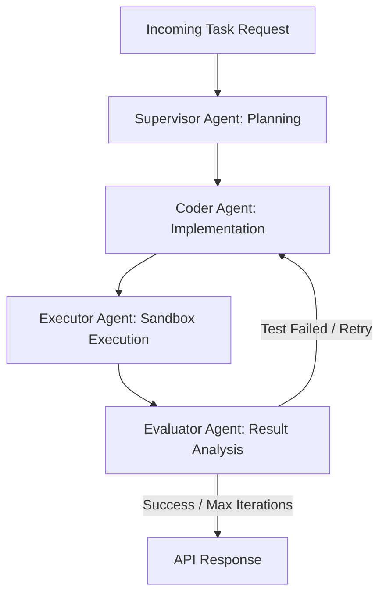

# Autonomous Multi-Agent Software Engineering System 

A production-grade, supervisor-worker multi-agent workflow built with **LangGraph** and **FastAPI**. This system automates complex software development tasks by planning execution steps, generating clean implementation code, running code safely in an isolated sandbox, and automatically evaluating/refactoring outputs based on execution feedback.

---

##  System Architecture & Workflow

Supervisor Node: Analyzes the task description and establishes a structured execution plan.

Coder Node: Generates self-contained, robust code matching the specifications.

Executor Node: Safely runs code in a controlled temporary environment with strict timeout safeguards.

Evaluator Node: Inspects execution output and determines if a self-correction retry loop is required.

##  Tech Stack
Orchestration: LangGraph, LangChain

API Framework: FastAPI, Uvicorn

Execution Environment: Isolated Python Subprocess Sandbox

LLM Integration: OpenAI API / Custom Gateways

##  API Usage
Once the server is running, access the interactive Swagger UI documentation at:
http://127.0.0.1:8000/docs

##  📄 License
Distributed under the MIT License. See LICENSE for more information.

