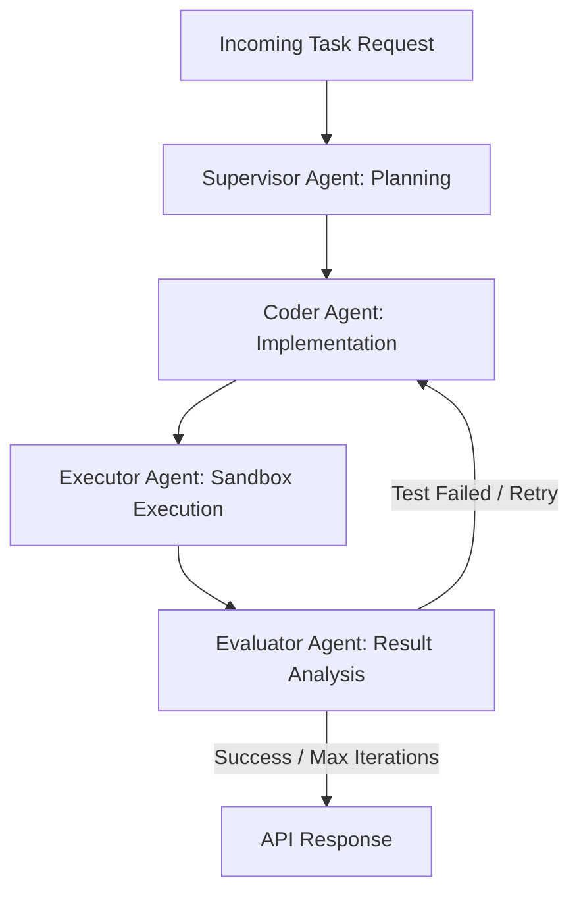

# Autonomous Multi-Agent Software Engineering System 

A production-grade, supervisor-worker multi-agent workflow built with **LangGraph** and **FastAPI**. This system automates complex software development tasks by planning execution steps, generating clean implementation code, running code safely in an isolated sandbox, and automatically evaluating/refactoring outputs based on execution feedback.

---

##  System Architecture & Workflow

Supervisor Node: Analyzes the task description and establishes a structured execution plan.

Coder Node: Generates self-contained, robust code matching the specifications.

Executor Node: Safely runs code in a controlled temporary environment with strict timeout safeguards.

Evaluator Node: Inspects execution output and determines if a self-correction retry loop is required.

##  Tech Stack
Orchestration: LangGraph, LangChain

API Framework: FastAPI, Uvicorn

Execution Environment: Isolated Python Subprocess Sandbox

LLM Integration: OpenAI API / Custom Gateways

##  Getting Started Locally
Prerequisites
Python 3.10 or higher

Git

Installation & Setup
Clone the repository:

Bash
git clone [https://github.com/Valentina14142000/autonomous-dev-agent.git](https://github.com/Valentina14142000/autonomous-dev-agent.git)
cd autonomous-dev-agent
Create and activate a virtual environment:

Bash
python -m venv venv
# On macOS / Linux:
source venv/bin/activate  
# On Windows (PowerShell):
.\venv\Scripts\Activate.ps1
Install dependencies:

Bash
pip install -r requirements.txt
Run the FastAPI server:

Bash
uvicorn app.main:app --reload

##  API Usage
Once the server is running, access the interactive Swagger UI documentation at:
http://127.0.0.1:8000/docs

Example cURL Request:
Bash
curl -X 'POST' \
  '[http://127.0.0.1:8000/run-agent](http://127.0.0.1:8000/run-agent)' \
  -H 'accept: application/json' \
  -H 'Content-Type: application/json' \
  -d '{
  "task_description": "Create a data cleaning and anomaly detection script"
}'
Example Response:
JSON
{
  "task": "Create a data cleaning and anomaly detection script",
  "plan": [
    "Step 1: Write clean, self-contained Python function.",
    "Step 2: Execute code inside secure sandbox environment.",
    "Step 3: Validate outputs against test assertions."
  ],
  "generated_code": "\ndef calculate_metrics(data: list) -> dict:\n    ...",
  "execution_output": "RESULT: {'mean': 20.33, 'anomaly_count': 1}\n",
  "test_passed": true,
  "error_message": ""
}
##  License
Distributed under the MIT License. See LICENSE for more information.

